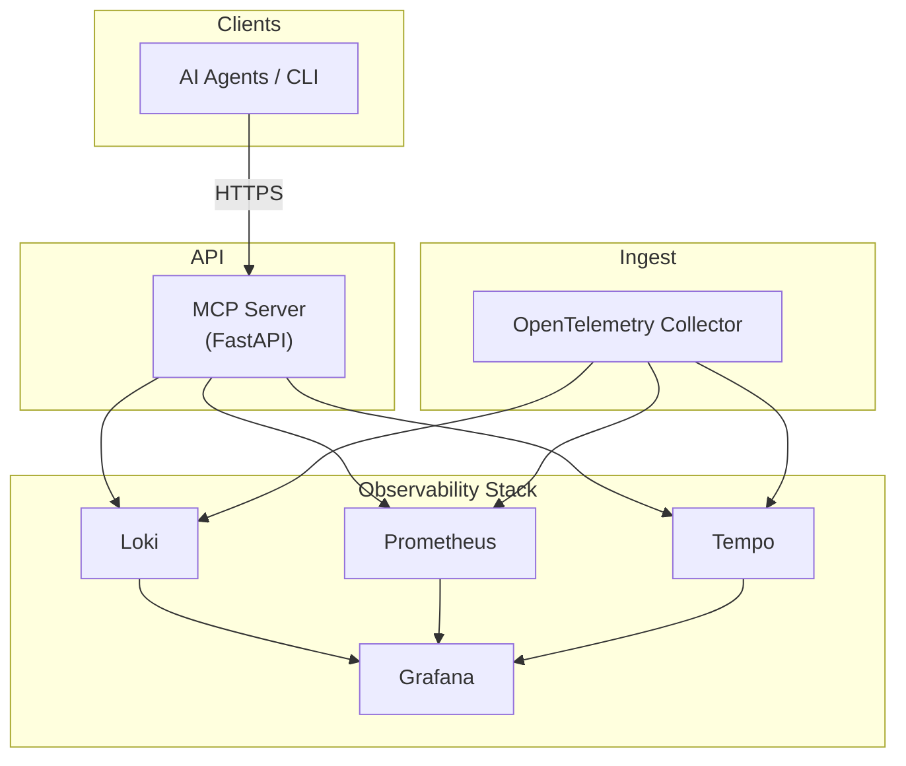

# MCP Observability FastAPI Service

This service exposes health, log, and metric endpoints that will be consumed by the MCP Observability platform.

## Table of Contents

- [Quick start](#quick-start-development)
- [Architecture overview](#architecture-overview)
- [Exposed Endpoints](#exposed-endpoints-mvp)
- [MCP Endpoints](#mcp-endpoints)
- [Deployment](#deployment)
- [Running as an MCP server](#running-as-an-mcp-server)
- [Authentication & TLS](#authentication--tls)
- [Documentation](#documentation)
- [Contributing](#contributing)

## Architecture overview



## Quick start (development)

```bash
# Install Poetry if you don't have it
pipx install poetry

# Install dependencies (Python 3.12)
poetry install --with dev

# Run the application with hot-reload
poetry run python -m app.main
```

Then visit `http://localhost:8000/health` to verify the service is running.

## Exposed Endpoints (MVP)

| Path | Method | Description |
|------|--------|-------------|
| `/health` | GET | Returns `{"status": "ok"}` when the service is healthy. |
| `/logs/errors` | GET | Fetches the last N error log lines from Loki (`limit` query param, default 100). |
| `/metrics/latency` | GET | Returns latency percentile from Prometheus (`percentile`, `window` query params). |

## MCP Endpoints

| Endpoint | Method | Purpose |
|----------|--------|---------|
| `/resources` | GET | List MCP Resources (metadata & optional inline content) |
| `/prompts` | GET | List templated Prompts, including `inputVariables` |
| `/sampling` | POST | Accepts SamplingRequest JSON and returns SamplingResponse |

All endpoints require a Bearer token (`MCP_TOKEN`) identical to the existing health/log/metrics routes.

### Example

```bash
curl -H "Authorization: Bearer $MCP_TOKEN" http://localhost:8000/resources | jq
```

## Tests

```bash
poetry run pytest -q
```

## Linting / Type-checking

```bash
poetry run black --check .
poetry run isort --check-only .
poetry run mypy app
```

## Deployment

### Local (Docker Compose)

```bash
# Start all components (fast, ephemeral storage)
docker compose -f mcp-obs.yml up -d

# Tear down
# docker compose -f mcp-obs.yml down -v
```

Services started:
* `mcp-server` – FastAPI application (port 8000)
* `grafana` – Dashboards UI (port 3000, default admin `admin/admin`)
* `prometheus` – Metrics (port 9090)
* `loki` – Logs (port 3100)
* `tempo` – Traces (port 3200)
* `otel-collector` – OpenTelemetry entry point (ports 4317/4318)

#### Accessing Grafana Dashboards

Once Compose is up you can explore the pre-bundled dashboards:

```text
URL:    http://localhost:3000
User:   admin
Pass:   ${GF_ADMIN_PASSWORD:-admin}
```

Dashboards are automatically provisioned into the **General** folder. After logging in, navigate to *Dashboards ▸ Browse* to view latency, error rate, and trace overview panels.

Tip: set `GF_ADMIN_PASSWORD` before running `docker compose` to override the default admin password:

```bash
export GF_ADMIN_PASSWORD="supersecret"
docker compose -f mcp-obs.yml up -d
```

The default Compose file uses **ephemeral named volumes**. Data vanishes on `down -v`. If you need persistence, map the volumes to host paths or use the Helm chart below.

### Kubernetes (Helm)

Prerequisites: Helm v3.12+ and access to a cluster.

```bash
# Update chart dependencies
ahelm dependency update charts/mcp-obs

# Install into namespace "observability"
helm install mcp charts/mcp-obs \
  --namespace observability --create-namespace \
  --set grafana.persistence.enabled=true \
  --set loki.persistence.enabled=true \
  --set prometheus.server.persistentVolume.enabled=true \
  --set tempo.persistence.enabled=true
```

Alternatively provide a `my-values.yaml`:

```yaml
persistence:
  enabled: true  # convenience flag (does **not** auto-propagate)

loki:
  persistence:
    enabled: true
    size: 10Gi
# ... other component overrides ...
```

```bash
helm install mcp charts/mcp-obs -f my-values.yaml --namespace observability --create-namespace
```

### Drift detection in CI
A GitHub Actions workflow (`.github/workflows/drift-check.yml`) automatically compares the services defined in `mcp-obs.yml` with the Helm chart dependencies. Pull requests touching either manifest will fail if they diverge. 

## Running as an MCP server

This repository also exposes the service via the **Model Context Protocol** (MCP). Install the extra dependency and run:

```bash
# install deps (if not already)
poetry install --with dev

# start the stdio MCP server
poetry run python -m app.mcp_server
```

Then add the server in clients such as Claude Desktop or the MCP Inspector:

```json
{
  "mcpServers": {
    "observability": {
      "command": "poetry",
      "args": ["run", "python", "-m", "app.mcp_server"]
    }
  }
}
```

## Authentication & TLS

All MCP Server endpoints are protected by **Bearer-token** authentication and, by default, served over **HTTPS**.

### 1. Setting the token (MCP_TOKEN)

The expected token is read from environment variable `MCP_TOKEN` **inside the server container**.  You must
provide the *same* token when making requests:

```bash
# Compose (docker compose up)
export MCP_TOKEN="s3cr3t"

# Helm
helm install mcp charts/mcp-obs \
  --namespace observability --create-namespace \
  --set mcpServer.env.MCP_TOKEN=$MCP_TOKEN
```

Requests that omit or supply the wrong token receive `401 Unauthorized`.

### 2. Local HTTPS (Compose)

The `mcp-certgen` sidecar automatically generates a self-signed CA and server certificate (valid 90 days, auto-rotated on restart) and mounts them into `mcp-server`.  Once Compose is up you can hit the `/health` endpoint:

```bash
curl -k \
  -H "Authorization: Bearer $MCP_TOKEN" \
  https://localhost:8000/health
# → {"status":"ok"}
```

* `-k` skips certificate verification because the server uses a self-signed cert.

### 3. Kubernetes (cert-manager)

When the chart installs with `tls.enabled=true` (default) it provisions:

* A self-signed `Issuer` named `mcp-selfsigned-issuer`.*
* A `Certificate` (90 days, `renewBefore: 30d`) stored in secret `mcp-server-tls`.

If you already operate cert-manager with a cluster-wide `ClusterIssuer`, disable issuer creation and reference your own:

```bash
helm install mcp charts/mcp-obs \
  --set "tls.issuer.create=false" \
  --set "tls.issuer.name=letsencrypt-prod" \
  --set "tls.issuer.kind=ClusterIssuer"
```

### 4. Example with mTLS client certificate

```bash
# generate client cert signed by sidecar CA
openssl req -newkey rsa:2048 -nodes -keyout client.key \
  -subj "/CN=example-client" -out client.csr

# CA is available at ./certs/ca.crt once compose is up
openssl x509 -req -in client.csr -CA certs/ca.crt -CAkey certs/ca.key \
  -CAcreateserial -out client.crt -days 30

curl --cert client.crt --key client.key \
  -H "Authorization: Bearer $MCP_TOKEN" \
  https://localhost:8000/health
# → {"status":"ok"}
```

*Replace `certs/` paths with the mounted location inside your dev environment.*

## Documentation

* [Grafana Dashboards](docs/dashboards.md) – screenshots and description of bundled dashboards. 

## Contributing

We welcome pull requests and issues!  Before you start, please read the [Contributor Guide](docs/contributing/index.md) which covers architecture, file layout, dev-environment setup and the workflow we use for issues & pull-requests.
