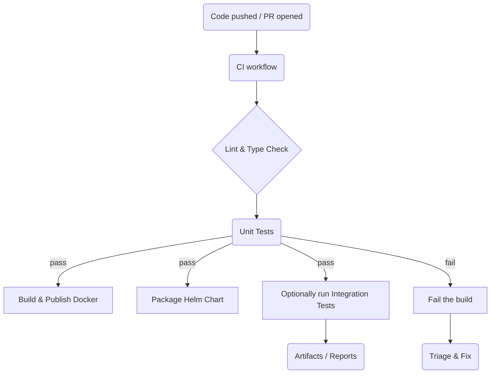

# Project Continuous Integration (CI)

> A quick guide to how our GitHub Actions pipelines work, where to watch them, and what to do when things go wrong.

---

## Overview of Workflows

| Workflow file | Trigger(s) | What it does |
| ------------- | ---------- | ------------ |
| `.github/workflows/ci.yml` | `push` to `main`, `pull_request` | Lints, formats, runs `mypy`, executes unit tests with coverage. Uploads coverage artifact. |
| `.github/workflows/docker-build.yml` | `push` to `main` (Docker-related paths) | Builds and publishes the MCP Server Docker image to GHCR. |
| `.github/workflows/helm-package.yml` | `push` to `main` (chart paths) | Packages the Helm chart and uploads it as an artifact. |
| `.github/workflows/integration-test.yml` | `workflow_dispatch` | Executes end-to-end integration tests with minimum 69 % coverage; manual trigger only. |

---

## High-Level Flow



---

## Monitoring Builds

1. **GitHub → Actions tab**  
   • Each workflow has its own entry. A colored icon (✔️ / ❌ / ⏳) shows status.  
   • Click into a run to view step-by-step logs and artifacts.

2. **Pull-Request Checks**  
   • PRs display required checks near the bottom. A red ❌ blocks merge until fixed.

3. **GitHub CLI**  
   ```bash
   gh run list --limit 20 | cat          # Recent runs
   gh run view <run-id> --log | less     # Live logs
   ```

4. **Badges** (coming soon) — we'll surface overall `main` build status in the README.

---

## Coverage Thresholds

| Workflow | Minimum Coverage |
| -------- | ---------------- |
| `ci.yml` (unit tests) | 90 % |
| `integration-test.yml` | 69 % |

Failing to meet the threshold will mark the job as failed and block the pipeline until coverage is restored.

---

## Dealing with Failures

| Symptom | Typical Cause | How to Fix |
| ------- | ------------- | ---------- |
| Lint step fails | Code not formatted or `mypy` errors | Run `poetry run black . && poetry run isort . && poetry run mypy app` locally, commit fixes. |
| Tests fail | Broken unit/integration tests | Reproduce locally with `poetry run pytest -q`. Fix code or tests. |
| Docker build fails | Dockerfile changed, dependency issue | Rebuild locally with `docker build .` and adjust Dockerfile or locks. |
| Helm package fails | Chart dependency or version mismatch | Run `helm dependency update charts/mcp-obs` and check `Chart.yaml`. |
| Workflow times out | Infinite loop, network flake | Inspect logs to locate the stuck command, optimise, or retry. |

### Common Actions

```bash
# Re-run the last failed job (UI): Actions → failed run → "Re-run jobs"
# Re-run via CLI:
RUN_ID=$(gh run list -s failure -L 1 --json databaseId -q '.[0].databaseId')
gh run rerun $RUN_ID
```

1. **Push a Fix** — most issues are resolved by committing corrective code.  
2. **Rerun Failed Jobs** — if the failure was transient (network glitch, etc.).  
3. **Seek Help** — comment `❗ Need input` on the relevant issue / PR.

---

## Where to Extend the Pipeline

* **Add a new stage:** create another YAML file in `.github/workflows/` or append a job to an existing one.  
* **Persist artifacts:** use `actions/upload-artifact@v4`.  
* **Publish images or charts:** follow the pattern in existing workflows (login → build → push).

---

_Last updated: 17 Jun 2025_ 