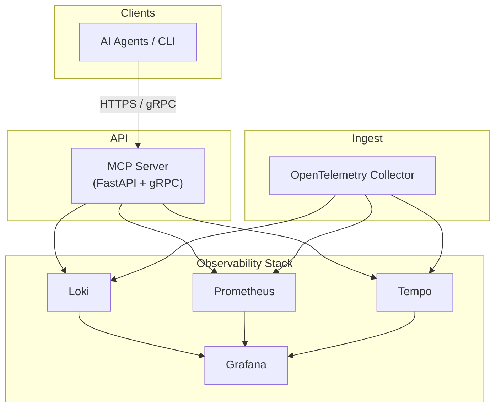

# Architecture Overview

This document gives you a **big-picture view** of the MCP Observability project: how the containers fit together **at runtime**, and how the **source code** is organised.

## 1 · Runtime Architecture

### Component responsibilities

| Component | Image / Path | Responsibility |
|-----------|--------------|----------------|
| **mcp-server** | `app/` | Stateless FastAPI server exposing REST/gRPC endpoints that query Loki/Prom/Tempo and return JSON tool responses. |
| **otel-collector** | defined in `mcp-obs.yml` / Helm | Ingest OTLP logs, metrics, traces and forwards to back-ends. |
| **Prometheus** | external container | Stores metrics and Alertmanager rules. |
| **Loki** | external container | Stores logs queried via LogQL. |
| **Tempo** | external container | Stores traces retrieved by span/trace ID. |
| **Grafana** | external container | Dashboards & alerting. No direct dependency for MCP, but useful for humans. |

## 2 · High-Level Source Tree

The table below maps **top-level directories** to their purpose. For a deeper dive see the dedicated `file-layout.md`.

| Path | Purpose |
|------|---------|
| `app/` | Application code for the FastAPI server (REST + gRPC) and domain modules (logs, metrics, traces, auth…). |
| `mcp_observability/` | Protobuf definitions & shared Pydantic schemas used by clients. |
| `charts/mcp-obs/` | Helm chart for Kubernetes deployment. |
| `mcp-obs.yml` | Docker Compose manifest for local stack. |
| `grafana/` | Provisioned dashboards JSON + datasource config. |
| `docs/` | All project & user documentation (you are here). |
| `scripts/` | Utility scripts (CI helpers, certgen, docs inventory, etc.). |
| `tests/` | Pytest test-suite covering API endpoints and helpers. |

---

*Next up:* read `file-layout.md` for a detailed file-by-file explanation. 