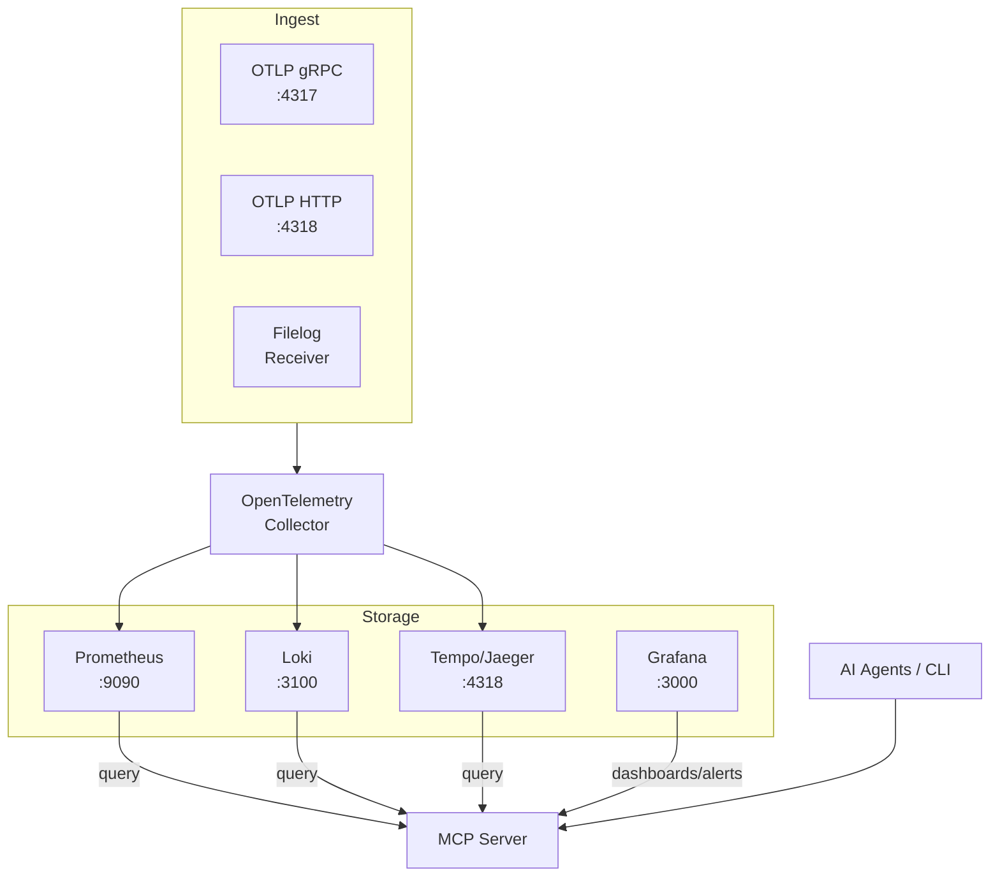

# Product Requirements Document – **MCP Observability**

*Version 1.0 • 15 Jun 2025*

---

## 1 · Executive Summary

*MCP Observability* is a reusable, cloud‑native observability bundle (Prometheus + Grafana + Loki + Tempo/Jaeger) augmented by a thin **MCP Server** that exposes AI‑friendly query endpoints. One Helm chart *or* one Docker‑Compose file delivers full‑stack ingestion (logs, metrics, traces) **and** a secure, single API for downstream AI agents and developers.

---

## 2 · Goals & Non‑Goals

| Goals                                                                                                                                                                                                                            | Out of scope                                                                                |
| -------------------------------------------------------------------------------------------------------------------------------------------------------------------------------------------------------------------------------- | ------------------------------------------------------------------------------------------- |
| • Turn‑key ingestion via **OpenTelemetry**.  \| • Single **MCP API** surfacing curated queries (logs, metrics, traces).  \| • Identical experience in Docker Compose and Helm/Kubernetes. \| • Secure by default (token / mTLS). | • Building new AI “insight” logic inside the stack.  \| • SaaS or proprietary dependencies. |

---

## 3 · High‑Level Architecture



---

## 4 · Key Components

| Component          | Responsibility                                                                  | Container / Chart                      |
| ------------------ | ------------------------------------------------------------------------------- | -------------------------------------- |
| **otel‑collector** | Intake OTLP gRPC/HTTP, container stdout (filelog).  Exports to Prom/Loki/Tempo. | `otel/opentelemetry-collector-contrib` |
| **Prometheus**     | Metrics store & Alertmanager.                                                   | `prom/prometheus`                      |
| **Loki**           | Log store / LogQL API.                                                          | `grafana/loki`                         |
| **Tempo**          | Distributed traces.                                                             | `grafana/tempo`                        |
| **Grafana**        | Dashboards, alerting (LLM App optional).                                        | `grafana/grafana-oss`                  |
| **MCP Server**     | Stateless query hub (REST / gRPC).                                              | `ghcr.io/your-org/mcp-server`          |

---

## 5 · Functional Requirements

| ID   | Description                                                           | Priority |
| ---- | --------------------------------------------------------------------- | -------- |
| FR‑1 | **Ingest** all logs/metrics/traces via OTLP and filelog.              | P0       |
| FR‑2 | `GET /logs/errors?service&limit` → last *n* error lines.              | P0       |
| FR‑3 | `GET /metrics/latency?p=0.95&service&range` → latency series.         | P0       |
| FR‑4 | `GET /trace/{trace_id}` → full trace JSON.                            | P1       |
| FR‑5 | Token or mTLS auth for all MCP endpoints.                             | P0       |
| FR‑6 | `helm install mcp-obs` deploys full stack on K8s.                     | P0       |
| FR‑7 | `docker-compose -f mcp-obs.yml up -d` boots services locally.         | P0       |
| FR‑8 | Pre‑bundled Grafana dashboards (IDs 16110, 13175, custom *ErrorOps*). | P1       |

---

## 6 · Non‑Functional Requirements

* **Performance** – MCP API median ≤ 150 ms for 7‑day window queries.
* **Security** – intra‑cluster traffic only; external ports minimal.
* **Extensibility** – new MCP endpoint ≤ 15 LoC & documented.
* **Observability** – MCP Server exports its own OTLP telemetry.

---

## 7 · Use‑Case Catalogue

1. **AI test agent** → “new `ConnectionTimeout` errors in `checkout-service` last 30 min.”
2. **Perf bot** polls latency endpoint, auto‑scales if p95 > SLA.
3. **Developer** pastes trace‑ID → correlated logs via `/logs/context?trace_id=`.

---

## 8 · Deployment & Configuration Highlights

### Helm values (excerpt)

```yaml
mcpServer:
  image: ghcr.io/your-org/mcp-server:1.0.0
  env:
    LOKI_URL: http://loki:3100
    PROM_URL: http://prometheus:9090
    TEMPO_URL: http://tempo:4318
    AUTH_TOKEN: ${MCP_TOKEN}
otelCollector:
  receivers:
    otlp:
      protocols: {grpc: {}, http: {}}
    filelog:
      include: [/var/log/containers/*.log]
```

### Compose patch (service)

```yaml
mcp-server:
  image: ghcr.io/your-org/mcp-server:1.0.0
  environment:
    - LOKI_URL=http://loki:3100
    - PROM_URL=http://prometheus:9090
    - TEMPO_URL=http://tempo:4318
    - AUTH_TOKEN=${MCP_TOKEN}
  ports:
    - "8081:8081"  # REST
```

---

| Date        | Deliverable                                          |
| ----------- | ---------------------------------------------------- |
| **T + 2 w** | PoC MCP Server (logs endpoint) under Compose.        |
| **T + 4 w** | Helm chart v0.1 (logs + metrics) & docs.             |
| **T + 6 w** | Metrics/Traces endpoints, Auth, ErrorOps dashboard.  |
| **T + 8 w** | First production install, load‑test, SLA validation. |

---

## 10 · Risks & Mitigations

| Risk                           | Impact                     | Mitigation                                          |
| ------------------------------ | -------------------------- | --------------------------------------------------- |
| Loki label cardinality blow‑up | Slow queries, storage cost | Strict label schema; body‑only dynamic fields       |
| Helm vs Compose drift          | Maintenance burden         | Generate Compose via `helm template` CI step        |
| MCP bottleneck                 | Latency & availability     | Stateless design + horizontal scaling + query cache |

---

## 11 · Success Metrics

* **< 5 min** to first successful install in a new repo.
* **≥ 90 %** of common queries answered via MCP (no direct Grafana/Loki).
* **p95 API latency < 150 ms** with 7‑day hot data.

---

## 12 · MCP Tool Endpoints

| Tool                          | Endpoint (REST)           | Method | Parameters / Notes                                                                      |
| ----------------------------- | ------------------------- | ------ | --------------------------------------------------------------------------------------- |
| **Fetch recent errors**       | `/logs/errors`            | GET    | `service`, `level`, `limit`, `range` – returns last *n* lines sorted by timestamp       |
| **Search logs (regex/text)**  | `/logs/search`            | POST   | JSON body: `{query, service, range}` – arbitrary LogQL compiled query                   |
| **Latency percentiles**       | `/metrics/latency`        | GET    | `service`, `percentile` (e.g. 0.95), `range` – Prometheus histogram\_quantile on demand |
| **Custom metric snapshot**    | `/metrics/query`          | POST   | Body: PromQL string – returns value series                                              |
| **Trace lookup**              | `/traces/{trace_id}`      | GET    | Path param: `trace_id` – raw Tempo/Jaeger trace JSON                                    |
| **Correlated logs for trace** | `/traces/{trace_id}/logs` | GET    | Uses span IDs to fetch matching log lines                                               |
| **Alert status**              | `/alerts`                 | GET    | Lists active Alertmanager alerts (JSON)                                                 |
| **Health check**              | `/health`                 | GET    | MCP server liveness & dependencies                                                      |

---

## 13 · User Story – *AI Agent “RetroBot”* 📖

> **Persona:** RetroBot, an autonomous test‑automation agent that validates every PR for Retro Swap Meet.

### Scenario 1 – Diagnose failing end‑to‑end test

1. PR pipeline triggers RetroBot.
2. End‑to‑end test fails with HTTP 500.
3. RetroBot calls `GET /logs/errors?service=checkout-service&limit=10&range=15m`.
4. MCP returns JSON with stack‑trace lines; RetroBot detects `ConnectionTimeout`.
5. RetroBot requests correlated trace: `GET /traces/{trace_id}` using ID from log.
6. With span data showing DB latency, RetroBot posts a GitHub comment suggesting increasing connection pool.

### Scenario 2 – Verify SLA after deployment

1. RetroBot waits 10 min post‑deploy.
2. Calls `GET /metrics/latency?service=api-gateway&percentile=0.95&range=10m`.
3. Receives p95 = 280 ms (below 300 ms target) → marks check ✅.
4. If value > 300 ms, RetroBot triggers `/alerts` to confirm no alert suppression, then pages DevOps.

### Scenario 3 – Regression hunting with custom query

1. During canary rollout, RetroBot posts PromQL to `/metrics/query`:

   ```json
   {
     "query": "rate(http_requests_total{service=\"image-resizer\",status=~\"5..\"}[5m])"
   }
   ```
2. Detects spike; automatically calls `/logs/search` with regex `"OutOfMemoryError"`.
3. Generates ticket with offending pod names extracted from log lines.

---

\*---

## 14 · MCP Compliance Matrix

| MCP Concept    | Implementation in MCP Observability                                                                                                                                                                                                                                                |
| -------------- | ---------------------------------------------------------------------------------------------------------------------------------------------------------------------------------------------------------------------------------------------------------------------------------- |
| **Resources**  | Expose log, metric, and trace datasets via REST URIs `/resources/{type}`; each includes metadata (`schema`, `updated_at`) so MCP clients can include them as context.                                                                                                              |
| **Prompts**    | Bundl([modelcontextprotocol.io](https://modelcontextprotocol.io/docs/concepts/resources?utm_source=chatgpt.com))emplates (e.g., `diagnose_error`, `compare_latency`) served at `/prompts` per MCP spec, allowing clients to inject standardized instructions into LLM calls.       |
| **Tools**      | Endpoints in §12 are surfa([modelcontextprotocol.io](https://modelcontextprotocol.io/docs/concepts/prompts?utm_source=chatgpt.com))so LLMs can invoke actions (fetch errors, traces, metrics). Tools follow the MCP JSON schema for tool definitions.                              |
| **Sampling**   | MCP Server supports `/sample` endpoint wher([modelcontextprotocol.io](https://modelcontextprotocol.io/docs/concepts/tools?utm_source=chatgpt.com))odel completions; server signs the request, routes via MCP "sampling" flow to allow on‑the‑fly root‑cause analysis by AI agents. |
| **Roots**      | Deployment‑specific "roots" (e.g., `k8s://namespace/retro`, \`fi([modelcontextprotocol.io](https://modelcontextprotocol.io/docs/concepts/sampling?utm_source=chatgpt.com)) declared in manifest so clients know valid resource scopes.                                             |
| **Transports** | Primary transport is HTTP/2 (REST+JSON); optional gRPC stream for high‑frequenc([modelcontextprotocol.io](https://modelcontextprotocol.io/docs/concepts/roots?utm_source=chatgpt.com)) MCP transport guidelines for idempotency and auth.                                          |

### Python Implementation Notes

* MCP Server written in **Python 3.12** using *FastAPI* for REST and *grpcio* for ([modelcontextprotocol.io](https://modelcontextprotocol.io/docs/concepts/architecture?utm_source=chatgpt.com))port.
* Shared Pydantic models enforce MCP JSON schemas for Resources, Prompts, Tools, and Sampling requests.
* Async httpx client used to query Loki/Prometheus/Tempo; results marshalled into MCP response objects.
* Unit tests with **pytest** and contract tests against cyanheads/mcp-resources reference suite.

---

Last updated: 15 Jun 2025\*
